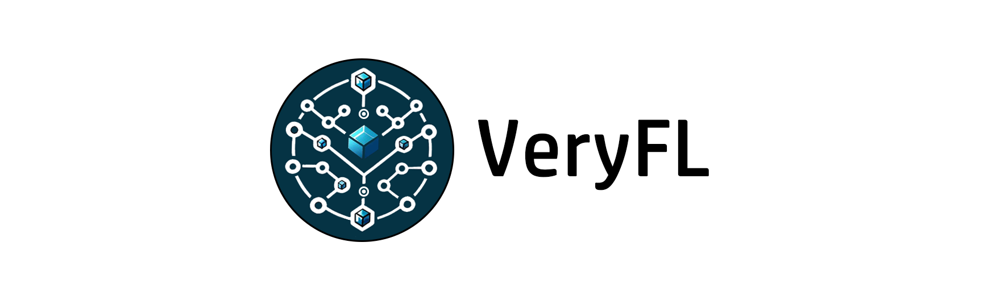

# VeryFL: A Federated Learning Framework Embedded with Blockchain
<div align="center">



[](https://github.com/pre-commit/pre-commit)


</div>

## Introduction
VeryFL is a simple federated learning framework embedded with blockchain (Etherenum). Federated Learning side uses PyTorch while blockchain-side use Solidity deployed on Ethereum to implement on-chain mechanism.
The main propose of VeryFL is to provide the blockchain-based FL algorithm with a real execution environment. However you can use VeryFL for:
 
 - Understanding basic workflow of the federated learning.
 - Verifying centralized federated learning algorithm.  
 - Verifying blockchain-based federated learning algorithm running on real Ethereum environment.

## Dependence

Ethereum Environment 
- [Nodejs](https://nodejs.org/en)

Node.js >= 16.0.0 and npm >= 7.10.0
- Ganache
```
npm install ganache --global
```
Python Environment
- Anaconda 

1. Python: 3.6 ~ 3.9

2. PyTorch: 1.13
- Brownie
```
pip install eth-brownie
```
## Basic Function 
### Execute federated learning experiment.
VeryFL can simulate the federated learning experiment with both centralized/de-centralized paradigm. VeryFL contains many image classification datasets and classic federated learning algorithms.

### On-chain Mechanism implemented with Solidity.
One of the main propose of VeryFL is to provide experiment environment for blockchain-based federated learning. With the embedded Ethereum network, on-chain mechanism can be implemented in Solidity and can be deployed in VeryFL.

### Model copyright protection and transaction .
By inject watermark into model through model watermarking technology, VeryFL implement a demo framework which can protect model copyright and execute model transaction by managing watermark on the blockchain.(Detail of this function can refer to our article below [2])

## Code Structure and Usage

### Quick Start

```
python test.py --benchmark FashionMNIST
```

```
#test.py
import argparse
from task import Task
import config.benchmark

if __name__=="__main__":
    parser = argparse.ArgumentParser()
    parser.add_argument('--benchmark', type=str, default="FashionMNIST", help="Running Benchmark(See ./config/benchmark.py)")
    args = parser.parse_args()
    benchmark = config.benchmark.get_benchmark(args.benchmark)
    global_args, train_args, algorithm = benchmark.get_args()
    classification_task = Task(global_args=global_args, train_args=train_args, algorithm=algorithm)
    classification_task.run()

```


### Customize Task Parameter
In ./config/benchmark.py, each Benchmark contains three parts
1. global_args: global FL parameters like client number, dataset, model.
2. train_args: training parameters like learning rate, weight decay.
3. Algorithm: federated learning algorithm (Aggregator, Client, Trainer)

### Add New FL Algorithm
1. Client side algoritm need to implement Trainer (./client/trainer) 
2. Server side algorithm need to implement aggregator (./server/aggregation_alg)

### Add New On-chain Mechanism
1. Implement algorim with Solidity (./chainEnv/contracts)
2. Deploy smart contract when network start (./chainfl/interact)
3. Wrap the function call with Brownie SDK in class chainProxy (./chainfl/interact)
4. Interact with blockchain when training through chainProxy.

## Troubleshooting

1. **FileNotFoundError: [Errno 2] No such file or directory**

When running the file test.py, error `No such file or directory: ../VeryFL/log/..` may occur if the specified path does not exist. Please check the `log_folder` variable in file `VeryFL/config/log.py` (by default it should be `log`). Create a subfolder of `VeryFL` named that variable (in the default case `log`) as: `VeryFL/log/.`

2. **AssertionError: Torch not compiled with CUDA enabled**

Please check the `device` parameter in the file `VeryFL/config/benchmark.py`. Change `cuda` to `cpu` if your cuda support isn't available (inproper installation of Pytorch, using platforms such as MacOS or Linux, etc.)

## Relative Article
[1] [VeryFL Design] [VeryFL: A Verify Federated Learning Framework Embedded with Blockchain](http://106.52.19.28/resource/VeryFL.pdf)(Arxiv)

[2] [Model Copyright] [Tokenized Model: A Blockchain-Empowered Decentralized Model Ownership Verification Platform](http://106.52.19.28/resource/Tokenized.pdf)(Arxiv)

[3] [Overall Background] [Towards Reliable Utilization of AIGC: Blockchain-Empowered Ownership Verification Mechanism](https://ieeexplore.ieee.org/stamp/stamp.jsp?arnumber=10254223)(OJCS 2023)

[4] [Using VeryFL] [A decentralized federated learning framework via committee mechanism with convergence guarantee](https://arxiv.org/pdf/2108.00365.pdf)(TPDS 2022)
